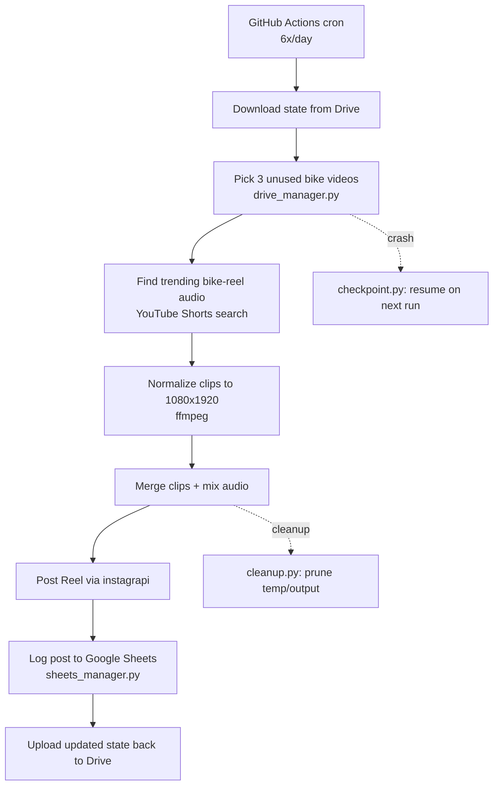

# igflows

Automated Instagram Reels pipeline that posts 6x/day. Each run merges 3 random bike videos from a shared Google Drive library, mixes in trending bike-reel audio pulled fresh from YouTube Shorts, and posts the result to Instagram.

## How it works

1. **Select** — picks 3 random, not-recently-used bike MP4s from the shared Drive `videos/` folder (`drive_manager.py`), tracked in `ig_tracker.json`.
2. **Source music** — instead of a static library, searches YouTube Shorts for trending bike-reel audio, picks randomly from the top results, and extracts the audio track fresh each run.
3. **Normalize & merge** — each clip is normalized to 1080×1920 with `ffmpeg` and concatenated; audio/video length is capped at whichever is shorter (max 59s).
4. **Post** — uploads the final reel to Instagram via `instagrapi`, reusing a saved session (`ig_session.json`) to avoid repeated 2FA challenges.
5. **Track & resume** — every step is checkpointed (`checkpoint.py`); a crash mid-run resumes from the last saved step on the next trigger instead of starting over. `sheets_manager.py` logs each post to a Google Sheets tracker, and `cleanup.py` prunes old temp/output files.

State (`ig_tracker.json`, `ig_checkpoint.json`, session/token files) lives in Google Drive between runs since GitHub Actions runners are stateless — it's downloaded at the start of each run and re-uploaded on success.



## Architecture

| File | Role |
|---|---|
| `pipeline_ci.py` | Main orchestrator — selection, ffmpeg encoding, Instagram upload |
| `drive_manager.py` | Google Drive OAuth + download/upload for videos and state |
| `checkpoint.py` | Checkpoint/resume state machine |
| `cleanup.py` | Disk management — wipes temp, trims old output |
| `sheets_manager.py` | Google Sheets post tracker |
| `ig_login.py` | One-time helper to generate the Instagram session file |

## Setup

```bash
pip install -r requirements_ci.txt
python ig_login.py            # one-time: generates ig_session.json
python drive_manager.py auth  # one-time: generates drive_token.json
python pipeline_ci.py
```

Runs automatically via GitHub Actions cron (6x/day, IST); see `CLAUDE.md` for required secrets and full constraints.
